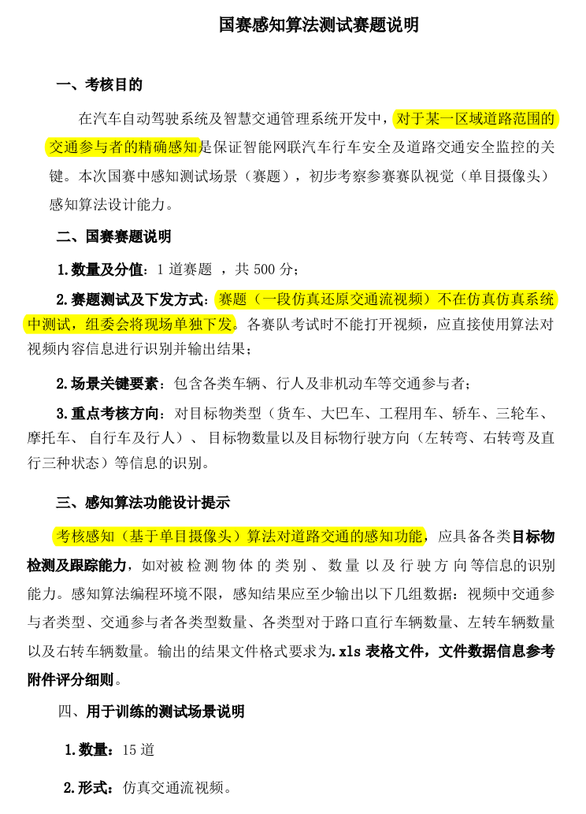

# 路口车流检测与辨向

这一工作线处理路口视频：准备 YOLO 格式数据集，训练目标检测模型，利用 Ultralytics 的目标跟踪结果，为车辆和行人计数并判断左转、右转或直行。原参赛方案在 18 个视频场景中使用 16 个训练场景、2 个验证或测试场景，并按每 5 帧抽取一帧制作数据集。

## 处理流程

1. `preprocess.py` 从视频和标注中抽帧，输出 YOLO 格式图片与标签。
2. `prepareDataset.py` 划分训练、验证集并生成 `data.yaml`。
3. `train.py` 调用 Ultralytics 训练检测模型。
4. `CarStreamTracker.py` 读取视频和权重，执行检测与跟踪；`DirectionTracker` 使用轨迹点判断方向，最终输出视频与 CSV 统计表。

| 脚本 | 用途 |
| --- | --- |
| [CarStreamTracker.py](scripts/CarStreamTracker.py) | 最终车流跟踪、计数与辨向脚本 |
| [preprocess.py](scripts/preprocess.py) | 视频与标注预处理 |
| [prepareDataset.py](scripts/prepareDataset.py) | 数据集划分与配置生成 |
| [train.py](scripts/train.py) | 检测模型训练 |
| [test.py](scripts/test.py) | 检测效果检查 |
| [mark.py](scripts/mark.py) | 图片标签可视化 |
| [tracker.py](scripts/tracker.py) | 早期跟踪实现，作为迭代记录保留 |
| [visualize_json.py](scripts/visualize_json.py) | JSON 标注可视化 |
| [visualize_txt.py](scripts/visualize_txt.py) | TXT 标注可视化 |

## 运行前提

脚本使用 Python、Ultralytics、OpenCV、NumPy、pandas 和 tqdm。训练与跟踪还需要外部视频、标注及模型权重；仓库未包含这些数据和权重。原脚本中的 `/home/zero/...` 路径是参赛机器上的路径，运行前需替换为本机文件位置。`ultralytics` 应作为外部 Python 依赖安装，仓库不再保留失效的 Git 子模块记录。

演示视频见[仓库总览](../README.md#演示与资料)，赛题文档见 [`docs/competition`](../docs/competition/)。
