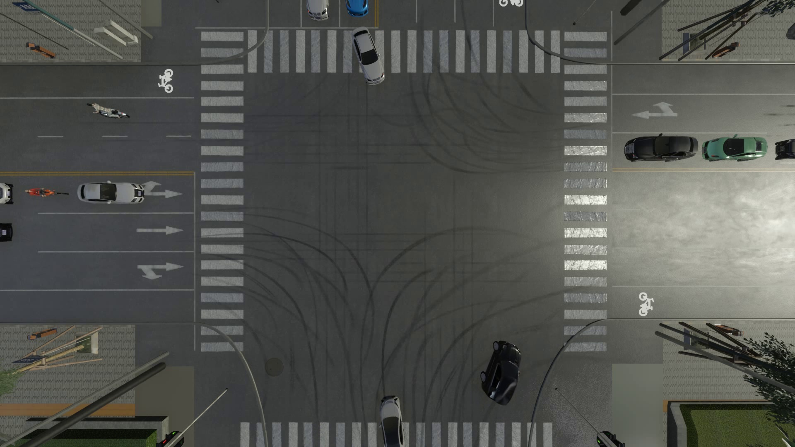
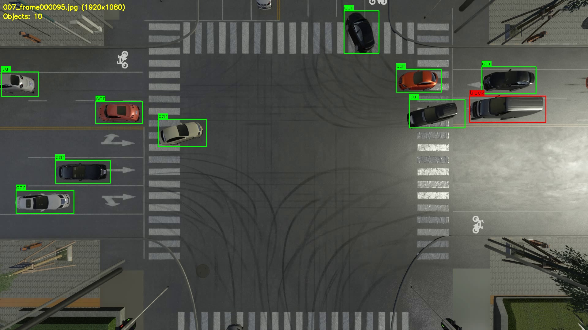

# 2025 NEVC 智能网联汽车项目

2025 年工创赛智能网联汽车赛道参赛代码与演示资料。项目包含两条并列的工作线：基于 SimOne 仿真平台的 ADAS 场景控制，以及基于 YOLO 的路口车流检测。原项目记录的成绩为 **全国特等奖**。

> 本仓库用于展示参赛实现与技术思路。ADAS 代码依赖赛事提供的 SimOne SDK 和工程头文件；感知脚本依赖外部数据、模型权重，并保留了参赛时的本机路径。阅读或复用时请先看各模块说明。

## 项目概览

| 模块 | 实现内容 | 代码入口 |
| --- | --- | --- |
| ADAS 场景控制 | 在测试场景中融合车道、高精地图、障碍物与交通灯信息，进行行驶决策和车辆控制 | [LKASample.cpp](ADAS/LKASample.cpp) |
| AEB | 基于前方障碍物状态进行制动控制 | [AEBSample.cpp](ADAS/AEBSample.cpp) |
| AVP | 根据停车位几何信息规划泊车与驶离轨迹 | [AVPPlanner.cpp](ADAS/AVPPlanner.cpp) |
| 路口车流检测 | 视频抽帧与数据集准备、YOLO 检测和跟踪、目标计数与转向统计 | [CarStreamTracker.py](Perception/scripts/CarStreamTracker.py) |

ADAS 的整体场景代码集中在 `LKASample.cpp`；AEB 和 AVP 也用于 ADAS 任务。各文件的职责和限制见 [ADAS 代码导览](ADAS/README.md)。感知工作线的处理流程见 [Perception 代码导览](Perception/README.md)。

## 演示与资料





- 演示视频：[跟踪结果](assets/videos/output_tracking_never.mp4) · [标注可视化](assets/videos/annotated_video.mp4) · [另一段可视化](assets/videos/output_video.mp4)
- 赛题与结果资料：[感知测试场景说明](docs/competition/国赛感知测试场景（赛题）说明-V1.3.pdf) · [仿真得分记录](docs/competition/仿真得分-10700.pdf) · [其他资料](docs/competition/)

## 仓库结构

```text
ADAS/                 SimOne 场景控制、AEB、AVP 源码及导览
Perception/scripts/   感知训练、预处理、跟踪和可视化脚本
assets/images/        文档配图
assets/videos/        演示视频
docs/competition/     赛题、评分表与结果资料
```

项目代码按仓库根目录的 [MIT License](LICENSE) 开源；赛事资料、第三方 SDK、模型和数据的使用以各自权利方的条款为准。
